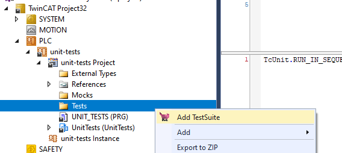
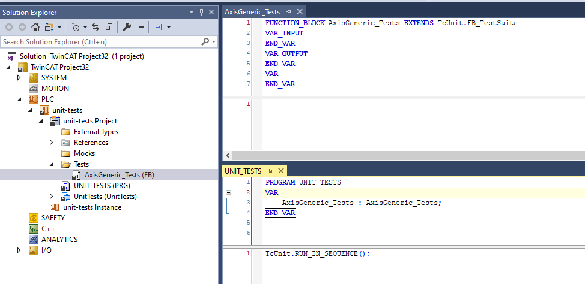
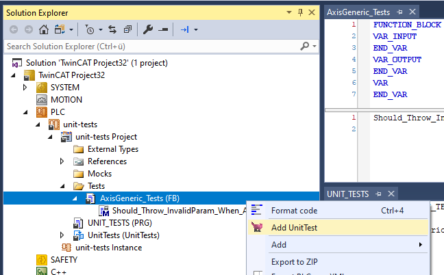
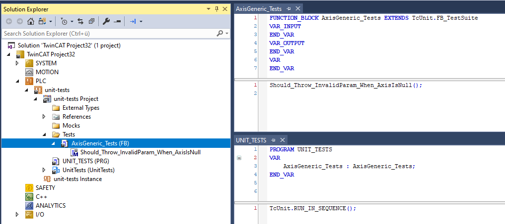
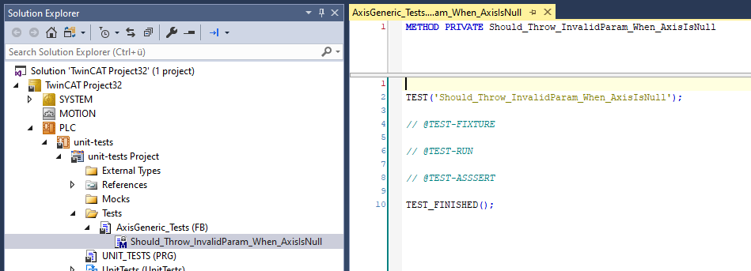
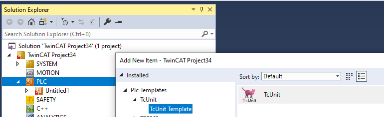
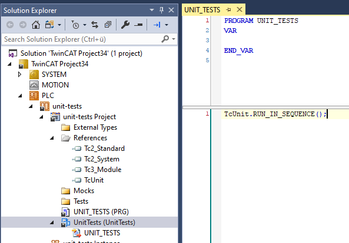

# TcUnit Visual Studio Extension
Visual Studio Extension for higher productivity when using TcUnit for unit testing with TwinCAT 3.1 from Beckhoff.

## Installation

### TcXaeShell:
1. Unzip the generated *.VSIX as archive
2. Copy it´s content to "C:\Program Files (x86)\Beckhoff\TcXaeShell\Common7\IDE\Extensions\TcUnit" 
3. Restart TcXaeShell

### Visual Studio:
1. Execute the TcUnit.vsix file
2. Select Visual Studio version

## Usage

### Add Test Suite

#### Add Test Case

## Visual Studio Test Explorer Support

Uses [TcUnit.TestAdapter](https://github.com/philippleidig/TcUnit-VsTestAdapter) for extending [vstest](https://github.com/microsoft/vstest)

## PLC Project Template

1. Copy the content from "./templates/TcUnit" to "C:\TwinCAT\3.1\Components\Plc\PlcTemplates\1.0.0.0\Plc Templates\TcUnit" on your engineering system
2. Restart Visual Studio or TcXaeShell
3. Add "TcUnit Template" as PLC project

3. Basic setup for unit testing is already included in the template

## License
[MIT](./LICENSE.MD)